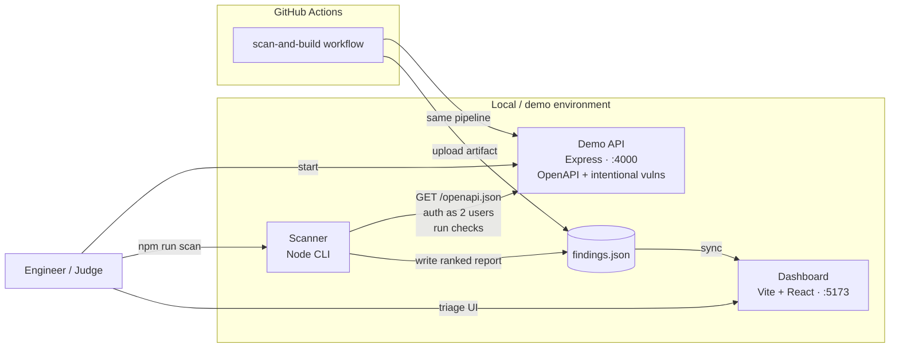
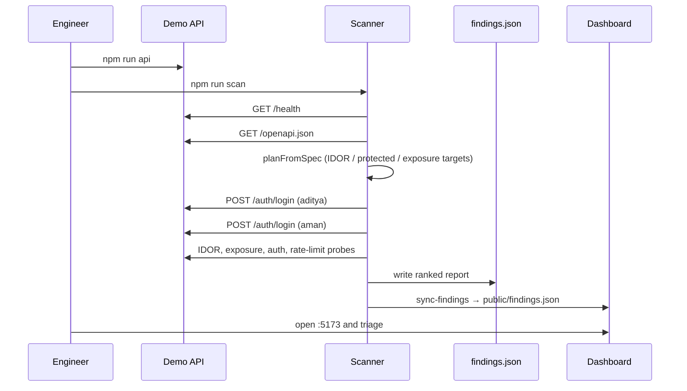
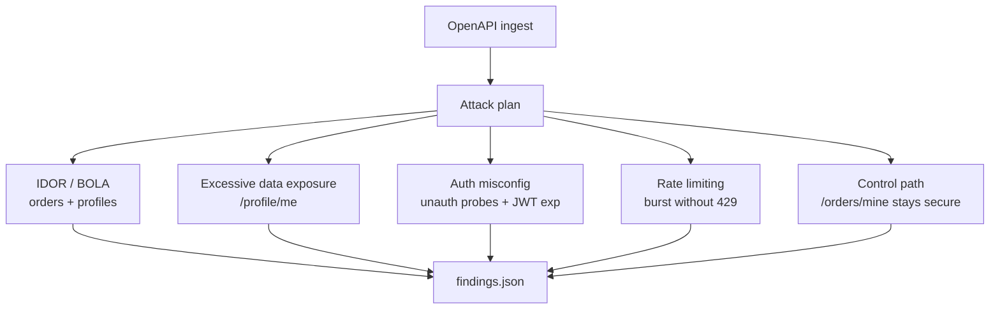

# InitiatorAPI — System Architecture

Zero-Trust API vulnerability scanner: a sandboxed demo API, an OpenAPI-driven scanner, a findings dashboard, and CI that runs the same pipeline on every push.

## Diagram (PPT-ready)

Use the **PNG** in PowerPoint (opens everywhere):

| File | Use |
|---|---|
| [`docs/architecture.png`](./docs/architecture.png) | Drop into PPT / PDF |
| [`docs/architecture.svg`](./docs/architecture.svg) | Editable vector (open in browser) |
| [`docs/architecture.html`](./docs/architecture.html) | Preview in Chrome/Safari |

## High-level system (editable Mermaid)

## Component roles

| Component | Path | Responsibility |
|---|---|---|
| Demo API | `/api` | Intentionally vulnerable storefront with JWT auth, seeded users, and a published OpenAPI contract at `GET /openapi.json` |
| Scanner | `/scanner` | Ingests OpenAPI, authenticates two users, runs IDOR / exposure / auth / rate-limit checks, writes severity-ranked findings |
| Dashboard | `/dashboard` | Engineer-facing triage UI over `findings.json` (severity filter, evidence, reproduction, recommendations) |
| CI | `.github/workflows/ci.yml` | Starts API → runs scanner → syncs findings → uploads artifact → builds dashboard |

## Scan data flow

## What the scanner checks

## Trust & scope boundary

- **In scope:** the local sandbox API (`localhost:4000`) and any API the operator is **explicitly authorized** to assess.
- **Out of scope:** unauthorized third-party / production systems.
- The scanner never mutates production data in the demo path; it authenticates as seeded users and reads endpoints defined by the OpenAPI plan.

## Tech stack

| Layer | Stack |
|---|---|
| API | Node.js, Express, JWT, bcrypt, OpenAPI 3 JSON |
| Scanner | Node.js CLI, native `fetch`, modular checks (`lib/checks.js`) |
| Dashboard | Vite, React |
| CI | GitHub Actions (Node 20), artifact upload of `findings.json` |
